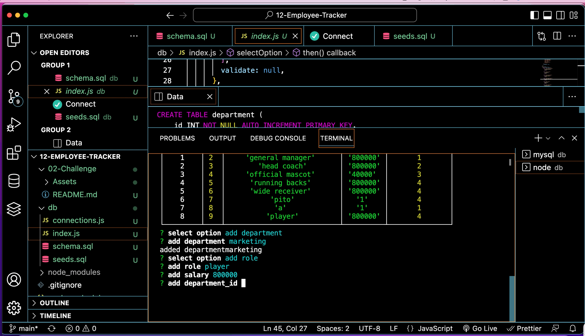

# 🏗️ 12-Employee-Tracker

---

## User Story 🏈
```md
AS A business owner
I WANT to be able to view and manage the departments, roles, and employee in Seattle Seahawks company
SO THAT I can organize and plan my business
```

## 📋 Acceptance Criteria

---
GIVEN a command line application that accepts user input

WHEN I start the application 

THEN I presented multiple options

WHEN I choose to view all departments

THEN I am presented with a formatted table showing department names and department ids

WHEN I choose to view all roles

THEN I am presented with the job title , role id, the department thar the role belongs to, and the salary for that role

WHEN I choose to view all employees

THEN I am presented with a formatted table showing employee data
WHEN I choose to add department

THEN I am able to enter the name of the department and that department is added to the database

WHEN I choose to add a role

THEN I am able to enter the name, salary, and department for the role and that role is added to the database

WHEN I choose to add an employee

THEN I am able to enter the employee's first name, last name, role, and manager, and that employee is added to the database


---

## 📐 Isntallation

* Install node
* Install Inquirer
* Install Mysql2

---
## Mock-Up 📷 

The following image shows a mock-up of the appearance and functionality:




